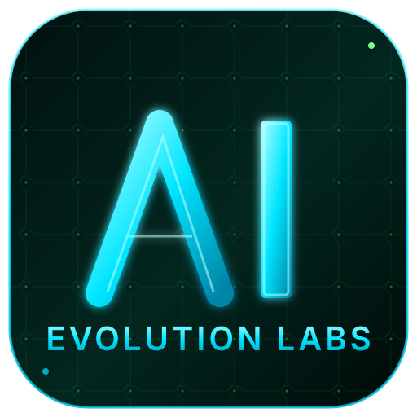

<div align="center">



# Hermes — AI Evolution Labs

### **Your business. Automated.**

The business AI agent workspace from **[AI Evolution Labs](https://aievolutionlabs.io)** — built for sales, ops, marketing, and back-office automation.

[](https://aievolutionlabs.io)
[](CHANGELOG.md)
[](LICENSE)
[](https://nodejs.org/)

**[🌐 Website](https://aievolutionlabs.io) · [⚡ Quick Start](#-quick-start) · [💼 Business Use Cases](#-built-for-business) · [📚 Docs](./docs)**

</div>

---

<div align="center">

<a href="https://aievolutionlabs.io">
  
</a>

</div>

---

## 🤖 What is Hermes?

**Hermes** is the flagship AI agent of **AI Evolution Labs** — a complete business operations workspace that runs autonomous agents for your company.

It is **not** another chat wrapper. It is a full command center where one or many AI agents work alongside your team — preparing client briefs, generating reports, automating workflows, monitoring competitors, and handling repetitive business tasks while your humans focus on decisions.

> 💡 **Built for businesses that want AI working for them — not the other way around.**

---

## 💼 Built for business

Hermes ships with first-class **business shortcuts** on the home screen — one click to launch the workflows your team actually runs:

<table>
<tr>
<td width="50%">

### 📄 Client brief / proposal
Draft tailored briefs, proposals, quotes, and pitch emails from 3 short inputs. Executive tone, ready to send.

</td>
<td width="50%">

### 📊 Report / business analysis
KPI reports, meeting summaries, exec dashboards, financial recaps. Markdown ready to paste into Notion.

</td>
</tr>
<tr>
<td width="50%">

### ⚙️ Workflow automation
Multi-step automations — cron jobs, MCP integrations, recipe playbooks. Wired to your stack.

</td>
<td width="50%">

### 🔍 Market intelligence
Competitor scans, market scans, news monitoring, due-diligence packages. Output as comparison tables.

</td>
</tr>
</table>

Hermes turns every team — sales, ops, marketing, finance, customer success — into an AI-augmented team.

---

## ✨ What's inside

| | |
|---|---|
| 💬 **Chat with the agent** | Real-time streaming, rich tool calls, multi-session memory, markdown + code highlighting |
| 🧠 **Memory** | Persistent business knowledge, searchable, editable in a live markdown editor |
| 🧩 **Skills library** | 2,000+ ready-to-use skills, badges, filters, marketplace |
| 🔌 **MCP integrations** | Notion, Gmail, Slack, GitHub, Supabase, Figma, Canva, Vercel and more |
| 📁 **Files + terminal** | Workspace file browser with Monaco editor + cross-platform PTY terminal |
| 🎮 **Operations** | Multi-agent dashboard with role presets (Sales, Ops, Marketing, Research, Finance) |
| 📡 **Conductor** | Break a goal into a mission, dispatch sub-agents, watch live progress |
| 👥 **Agent View** | Live agent panel with avatar, queue, history, cost meter |
| 🐝 **Swarm Mode** | Persistent multi-agent workers with role-based dispatch |
| 🗄️ **Dashboard** | Aggregated business overview: sessions, model mix, cost ledger, ops strip |
| 🎨 **Brand theme** | AI Evolution Labs black + neon-cyan + lime PCB — flagship business UI |
| 🌍 **Onboarding (5 langs)** | Polski · English · Español · Deutsch · Français — auto-detected |
| 🔒 **Security** | Auth middleware, CSP, path-traversal guard, fail-closed remote bind |
| 📱 **PWA + desktop** | Install as native PWA or build Electron .dmg/.exe with branded icon |

---

## 🚀 Quick start

Pick the path that matches you. All three are **2 minutes or less**.

### Path 1 — One-line install (macOS / Linux)

```bash
curl -fsSL https://raw.githubusercontent.com/aievolutionpl/hermes-aievolutionlaba/main/install.sh | bash
```

This installs the `hermes-agent` runtime, clones this repo, sets up `.env`, and installs dependencies. Then:

```bash
cd hermes-aievolutionlaba
pnpm dev
```

Open **[http://localhost:3000](http://localhost:3000)** → the welcome tour opens automatically in your language.

### Path 2 — Docker Compose

```bash
git clone https://github.com/aievolutionpl/hermes-aievolutionlaba.git
cd hermes-aievolutionlaba
cp .env.example .env
docker compose up -d
```

Pulls pre-built images (`hermes-agent` gateway + Hermes UI). Open **[http://localhost:3000](http://localhost:3000)**.

### Path 3 — Local dev

```bash
git clone https://github.com/aievolutionpl/hermes-aievolutionlaba.git
cd hermes-aievolutionlaba
pnpm install
cp .env.example .env
pnpm dev
```

> 💡 **Tip:** Set `HERMES_API_URL` in `.env` if your `hermes-agent` runs somewhere other than `http://127.0.0.1:8642`.

---

## 📦 Install as a desktop app

Hermes ships as a real desktop application with a branded icon.

### Install as PWA (any platform, 1 click)

1. Open **[http://localhost:3000](http://localhost:3000)** in Chrome / Edge / Safari
2. Click the **install icon** in the address bar (or `⋮ → Install Hermes AIEL`)
3. The shortcut lands on your desktop with the **AI Evolution Labs logo**
4. Launches as a standalone window — no browser chrome

### Build as native Electron app (`.dmg` / `.exe`)

```bash
pnpm electron:build:mac      # → release/Hermes AIEL-3.0.0.dmg
pnpm electron:build:win      # → release/Hermes AIEL Setup 3.0.0.exe
```

The installer creates a desktop shortcut using `public/aievolutionlabs-icon-1024.png`. See **[docs/branding.md](./docs/branding.md)** for the icon export workflow.

---

## 🌍 Onboarding — in your language

First time opening Hermes? A **welcome panel** opens automatically and explains:

- 🤖 **What Hermes is** — an autonomous business agent, not a chatbot
- 🎯 **What it can do** — briefs, reports, automations, research
- 🧭 **How to use it** — chat, conductor, swarm, MCP, skills
- 🚀 **A starter task** — one click launches your first real deliverable

Available languages: **🇵🇱 Polski · 🇬🇧 English · 🇪🇸 Español · 🇩🇪 Deutsch · 🇫🇷 Français**

Re-open it any time from the sidebar footer.

---

## 🎨 The AI Evolution Labs theme

The default theme matches the AI Evolution Labs brand identity — **deep black surfaces, electric cyan accents (`#00E5FF`), neon lime PCB highlights (`#7DFF8A`)**. A flagship-grade business interface inspired by the energy of the brand.

Want something else? Hermes ships with **13 other themes** — Nous, Matrix, Bronze, Slate, SciFi, light + dark variants. Pick from **Settings → Appearance**.

---

## 🧱 Architecture

Hermes by AI Evolution Labs is a **zero-fork workspace** built on top of vanilla [`hermes-agent`](https://github.com/NousResearch/hermes-agent) by Nous Research. We don't patch the agent runtime — we wrap it with a business-first UI, brand identity, business shortcuts, multilingual onboarding, and integrations.

```
┌───────────────────────────────────────────────────────────────┐
│           Hermes by AI Evolution Labs (this repo)             │
│                                                                │
│   Chat · Dashboard · Conductor · Swarm · Skills · MCP · …     │
│   AI Evolution Labs brand · Business shortcuts · Onboarding   │
└───────────────────────────────────────────────────────────────┘
                              │
                              ▼ HTTP / WS
┌───────────────────────────────────────────────────────────────┐
│            hermes-agent (Nous Research — vanilla)             │
│                                                                │
│   Gateway · Sessions · Memory · Skills · Tools · MCP runtime  │
└───────────────────────────────────────────────────────────────┘
                              │
                              ▼ OpenAI-compatible API
┌───────────────────────────────────────────────────────────────┐
│      Your LLM (OpenAI · Anthropic · Google · OpenRouter)      │
└───────────────────────────────────────────────────────────────┘
```

---

## 🧪 Development

```bash
pnpm install       # install dependencies
pnpm dev           # vite dev server (http://localhost:3000)
pnpm build         # production build
pnpm lint          # eslint
pnpm test          # vitest
npx tsc --noEmit   # type check
```

See **[CONTRIBUTING.md](./CONTRIBUTING.md)** for branch + PR guidelines.

---

## 📁 Project layout

```
hermes-aievolutionlaba/
├── public/
│   ├── aievolutionlabs-logo.svg     # primary brand mark
│   ├── aievolutionlabs-icon.svg     # PWA / desktop install icon
│   ├── aievolutionlabs-hero.jpg     # marketing hero (user-uploaded)
│   ├── aievolutionlabs-hero.svg     # SVG fallback for the hero
│   └── manifest.json                # PWA manifest — references icon files
├── src/
│   ├── lib/
│   │   ├── theme.ts                 # 14 themes — aievolution is default
│   │   └── onboarding-i18n.ts       # welcome-tour strings (5 langs)
│   ├── components/onboarding/
│   │   └── welcome-tour-panel.tsx   # the multilingual welcome modal
│   ├── hooks/use-welcome-tour.ts    # tour state (lang + seen flag)
│   ├── screens/dashboard/components/
│   │   └── aievolutionlabs-hero-card.tsx   # dashboard hero → aievolutionlabs.io
│   └── screens/chat/components/
│       └── chat-empty-state.tsx     # business shortcuts (briefs / reports / …)
├── skills/                          # SKILL.md packs (business skills)
├── docs/
│   └── branding.md                  # asset slots + install icon workflow
└── electron-builder.config.cjs      # desktop installer config (branded)
```

---

## 🛡️ Security

If you discover a vulnerability, please follow the responsible disclosure process in **[SECURITY.md](./SECURITY.md)**.

---

## 📖 License

[MIT](./LICENSE) — © 2026 AI Evolution Labs.

Built on top of [`hermes-agent`](https://github.com/NousResearch/hermes-agent) by [Nous Research](https://nousresearch.com/), used under its license. Original Hermes Workspace UI scaffolding © 2026 Eric (outsourc-e), MIT.

---

<div align="center">

**[🌐 aievolutionlabs.io](https://aievolutionlabs.io)** · Built with 🖤 by **AI Evolution Labs**

</div>
