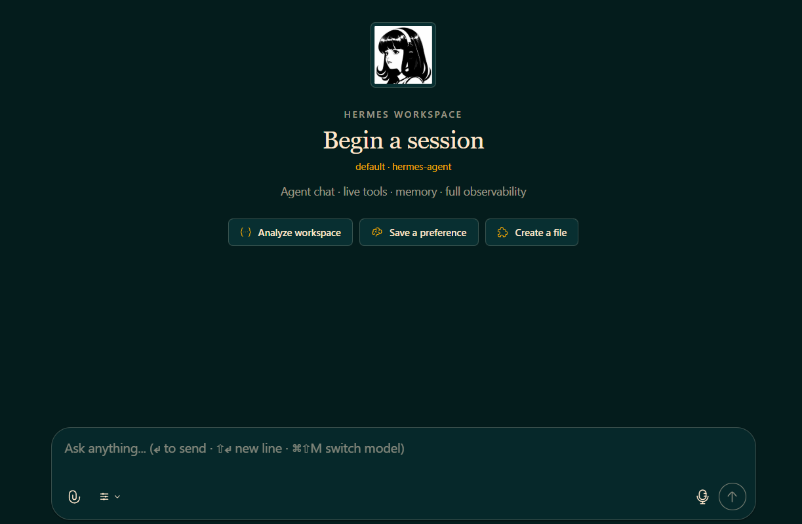
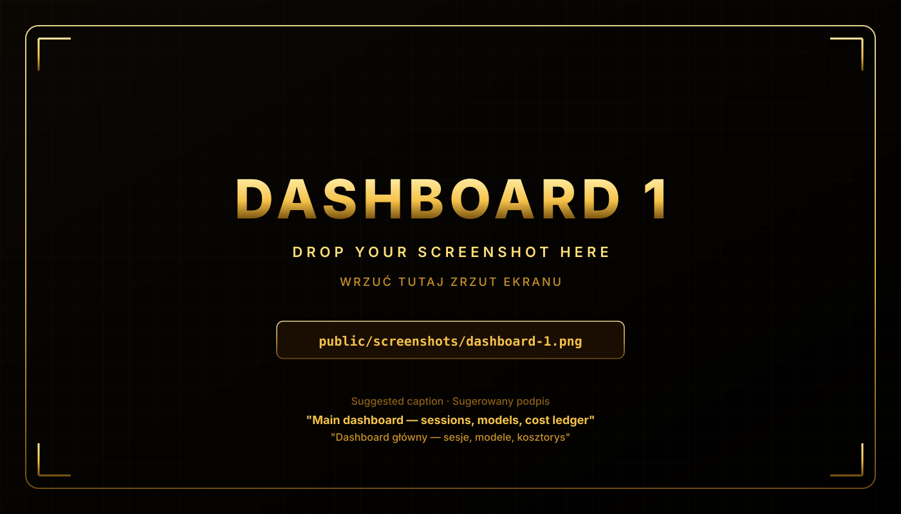
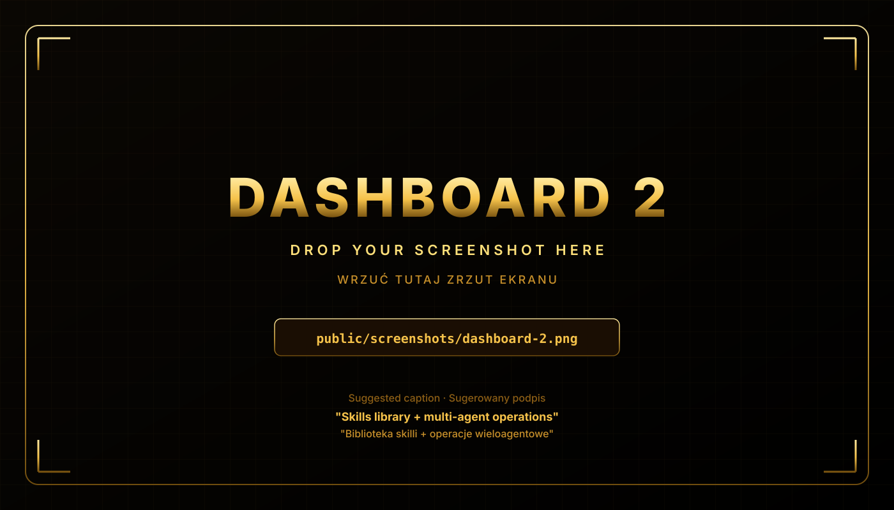
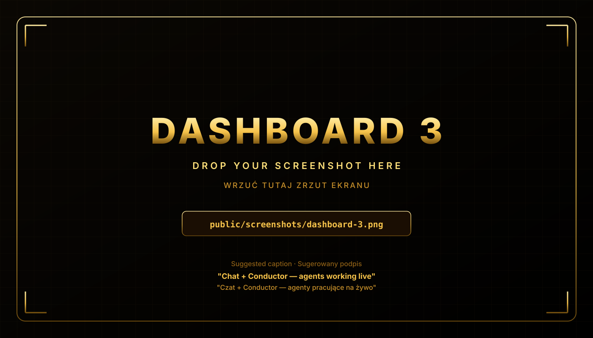

<div align="center">


# Evolution Agent · AI Evolution Labs

### **Your business. Automated.**

The flagship business AI agent workspace from **[AI Evolution Labs](https://aievolutionlabs.io)** — built for sales, operations, marketing, finance, and back-office automation.

[](https://aievolutionlabs.io)
[](CHANGELOG.md)
[](LICENSE)
[](https://nodejs.org/)

**[⚡ Quick start](#-quick-start) · [💼 Use cases](#-what-hermes-does) · [🧠 Agent setup](#-multi-agent-workspace) · [🛠️ Product tour](#️-product-tour) · [📚 Documentation](./docs) · [🇵🇱 Wersja polska](#-wersja-polska)**

</div>

---

<div align="center">
  
  <br />
  <sub>Hero image loaded from <code>public/hermes-warrior.png</code>.</sub>
</div>

---

<div align="center">
  
  <br />
  <sub><b>Evolution Agent Dashboard</b>: live sessions, model mix, skills catalog, cost ledger, and workflow controls.</sub>
</div>

---

## 🚀 Quick start

```bash
git clone https://github.com/aievolutionpl/Evolution-Agent.git
cd Evolution-Agent
npm install
npm run dev
```

Then open the local URL shown in your terminal and start from the **Business Shortcuts** panel.

---

## ✨ Why teams choose Hermes

- **Production-focused agent workspace** — not just chat, but a real ops cockpit.
- **Forked from Hermes, extended by AI Evolution Labs** — with a business dashboard and operator workflow layer designed for SMB teams.
- **Business deliverables by default** — proposals, reports, analyses, workflows, and summaries.
- **Multi-agent orchestration** — role-based workers for building, reviewing, QA, and research.
- **Reusable skills and playbooks** — consistent outputs across teams.
- **Executive visibility** — dashboard-level insight into activity and cost.

---

## 💼 What Hermes does

<table>
<tr>
<td width="50%" valign="top">

### 📄 Sales & client delivery
- Proposal drafts from RFP input
- Pricing options and scope tables
- Follow-up email sequences

</td>
<td width="50%" valign="top">

### 📊 Operations & reporting
- Weekly KPI recaps
- Meeting notes → action plans
- Board-ready monthly summaries

</td>
</tr>
<tr>
<td width="50%" valign="top">

### ⚙️ Workflow automation
- Scheduled jobs (cron)
- MCP-connected task flows
- Repeatable team playbooks

</td>
<td width="50%" valign="top">

### 🔍 Intelligence & monitoring
- Competitor watchlists
- Market and news scans
- Risk flags and due-diligence packs

</td>
</tr>
</table>

---

## 🧪 Real prompt examples (copy/paste)

### 1) Sales proposal assistant
```text
Draft a 1-page proposal for ACME based on this RFP.
Include: scope, milestones, timeline, and 3 pricing tiers.
Output: proposal.md + cover-email.txt.
```

### 2) Finance reconciliation
```text
Compare this week’s invoices with our SaaS ledger.
Flag all mismatches above $200 and group by vendor.
Output: reconciliation.md + anomalies.csv.
```

### 3) Marketing content sprint
```text
Create 5 LinkedIn posts for our Q3 launch.
Tone: credible and practical.
Languages: EN + PL.
Output: posts/1..5.md + schedule.csv.
```

### 4) Executive briefing
```text
Prepare a pre-call investor brief for TechCo.
Include: latest milestones, key risks, 5 probable questions, and suggested answers.
Output: exec-brief.md.
```

### 5) Customer support summary
```text
Summarize all support tickets from the last 7 days.
Cluster by theme, highlight urgent issues, and propose response macros.
Output: support-summary.md.
```

---

## 🧠 Multi-agent workspace

Hermes ships with a semantic worker roster (defined in `swarm.yaml`) so each role has clear ownership:

- **orchestrator** → planning and routing
- **builder** → implementation
- **reviewer** → quality gate / code review
- **qa** → smoke checks and behavior verification
- **researcher** → web + evidence gathering
- **maintainer / ops-watch / km-agent / strategist / inbox-triage** → specialized workflows

This structure enables fast delegation without losing accountability.

---

## 🧩 Built-in skills (what’s most important)

Hermes in this repo includes **11 built-in skills** in the local `skills/` catalog:

1. `workspace-dispatch` — safe multi-worker delegation and handoff conventions.
2. `deep-research` — structured research with evidence and confidence notes.
3. `operator-humanizer` — humanizes outputs for client-ready communication.
4. `viral-content-architect` — social content systems focused on reach and retention.
5. `universal-copywriter` — conversion-oriented copy across formats.
6. `seo-audit-engine` — SEO diagnostics and prioritized optimization plans.
7. `saas-ideation-and-pricing` — SaaS concept design and monetization models.
8. `paid-ads-strategist` — channel strategy, budget logic, and KPI-driven testing.
9. `ad-creator` — ad creative/copy variants for campaign execution.
10. `make-automation-hub` — Make.com workflow architecture and reliability checklists.
11. `skill-builder` — framework to create new reusable team skills.

### Why this matters for small businesses

- **Virtual employee behavior**: Hermes can act like an always-on teammate for ops, sales, and marketing execution.
- **Marketing-first toolkit**: content, SEO, paid ads, and ad creation skills are available out of the box.
- **Automation-ready workflows**: skills are structured to produce reusable outputs, not one-off chat replies.

---

## 🛠️ Product tour

### Dashboard gallery

<picture>
  <source srcset="./public/screenshots/dashboard-1.png" type="image/png">
  
</picture>

**Dashboard 1**  
Sessions, active models, cost ledger  
`public/screenshots/dashboard-1.png`

<br />

<picture>
  <source srcset="./public/screenshots/dashboard-2.png" type="image/png">
  
</picture>

**Dashboard 2**  
Skills library and multi-agent operations  
`public/screenshots/dashboard-2.png`

<br />

<picture>
  <source srcset="./public/screenshots/dashboard-3.png" type="image/png">
  
</picture>

**Dashboard 3**  
Chat + conductor with live agent execution  
`public/screenshots/dashboard-3.png`

> PNG images automatically override SVG placeholders. For clean layout, keep screenshot ratio near **16:9**.

---

## 📚 Documentation

- `docs/swarm/README.md` — worker topology and role design
- `docs/playground/README.md` — local playground setup
- `docs/hermesworld/README.md` — visual / product world assets

---

# 🇵🇱 Wersja polska

## Evolution Agent · AI Evolution Labs

### **Twój biznes. Zautomatyzowany.**

Flagowy workspace agentów AI od **[AI Evolution Labs](https://aievolutionlabs.io)** — zbudowany pod sprzedaż, operacje, marketing, finanse i automatyzację back-office.

---

## 🚀 Szybki start

```bash
git clone https://github.com/aievolutionpl/Evolution-Agent.git
cd Evolution-Agent
npm install
npm run dev
```

Następnie otwórz lokalny adres z terminala i zacznij od panelu **Business Shortcuts**.

---

## ✨ Dlaczego zespoły wybierają Hermes

- **Workspace pod realną pracę** — nie tylko czat, ale kompletne centrum operacyjne.
- **Fork Hermesa rozbudowany przez AI Evolution Labs** — z dashboardem i warstwą operacyjną dla małych firm.
- **Gotowe materiały biznesowe** — oferty, raporty, analizy, automatyzacje i podsumowania.
- **Orkiestracja wielu agentów** — role do budowania, review, QA i researchu.
- **Skille i playbooki wielokrotnego użytku** — spójna jakość odpowiedzi w całym zespole.
- **Widoczność dla liderów** — dashboard kosztów, aktywności i wydajności.

---

## 💼 Co potrafi Hermes

<table>
<tr>
<td width="50%" valign="top">

### 📄 Sprzedaż i delivery
- Oferty na podstawie RFP
- Warianty cenowe i zakres prac
- Sekwencje follow-up mailowe

</td>
<td width="50%" valign="top">

### 📊 Operacje i raportowanie
- Tygodniowe podsumowania KPI
- Notatki ze spotkań → plan działań
- Miesięczne raporty dla zarządu

</td>
</tr>
<tr>
<td width="50%" valign="top">

### ⚙️ Automatyzacja workflow
- Zadania harmonogramowane (cron)
- Przepływy połączone przez MCP
- Powtarzalne playbooki zespołowe

</td>
<td width="50%" valign="top">

### 🔍 Wywiad i monitoring
- Watchlisty konkurencji
- Skany rynku i newsów
- Flagi ryzyk + paczki due-diligence

</td>
</tr>
</table>

---

## 🧩 Najważniejsze skille (wbudowane)

W tym repo Hermes ma **11 wbudowanych skilli** w katalogu `skills/`:

1. `workspace-dispatch`
2. `deep-research`
3. `operator-humanizer`
4. `viral-content-architect`
5. `universal-copywriter`
6. `seo-audit-engine`
7. `saas-ideation-and-pricing`
8. `paid-ads-strategist`
9. `ad-creator`
10. `make-automation-hub`
11. `skill-builder`

To praktycznie oznacza, że Hermes działa jak **wirtualny pracownik** dla SMB: pomaga w marketingu, tworzeniu reklam, analizie rynku i automatyzacjach procesów.

---

## 🧪 Realne przykłady promptów (kopiuj/wklej)

### 1) Asystent ofert sprzedażowych
```text
Przygotuj 1-stronicową ofertę dla ACME na bazie tego RFP.
Uwzględnij: zakres, kamienie milowe, timeline i 3 warianty cenowe.
Output: proposal.md + cover-email.txt.
```

### 2) Uzgadnianie finansów
```text
Porównaj faktury z tego tygodnia z naszym rejestrem SaaS.
Oznacz wszystkie rozjazdy powyżej 200 USD i pogrupuj po dostawcy.
Output: reconciliation.md + anomalies.csv.
```

### 3) Sprint marketingowy
```text
Stwórz 5 postów LinkedIn o naszym starcie Q3.
Ton: merytoryczny i konkretny.
Języki: PL + EN.
Output: posts/1..5.md + schedule.csv.
```

### 4) Brief dla zarządu
```text
Przygotuj brief przed rozmową inwestorską z TechCo.
Uwzględnij: ostatnie kamienie milowe, kluczowe ryzyka, 5 prawdopodobnych pytań i sugerowane odpowiedzi.
Output: exec-brief.md.
```

### 5) Podsumowanie supportu
```text
Podsumuj wszystkie zgłoszenia supportowe z ostatnich 7 dni.
Pogrupuj po tematach, wskaż pilne sprawy i zaproponuj makra odpowiedzi.
Output: support-summary.md.
```

---

## 🧠 Workspace wieloagentowy

Hermes działa na semantycznym rosterze workerów (opisanym w `swarm.yaml`), dzięki czemu każda rola ma jasną odpowiedzialność:

- **orchestrator** → planowanie i routing
- **builder** → implementacja
- **reviewer** → quality gate / code review
- **qa** → smoke testy i weryfikacja działania
- **researcher** → research i źródła
- **maintainer / ops-watch / km-agent / strategist / inbox-triage** → role specjalistyczne

To podejście przyspiesza delegowanie i poprawia przewidywalność jakości.

---

## 📚 Dokumentacja

- `docs/swarm/README.md` — topologia workerów i podział ról
- `docs/playground/README.md` — lokalny playground
- `docs/hermesworld/README.md` — assety wizualne i warstwa produktowa
