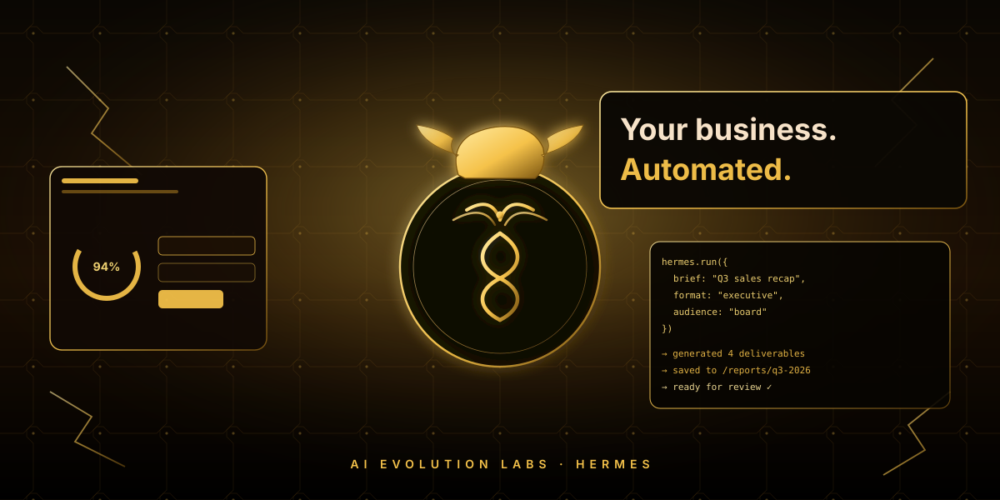

<div align="center">


# Hermes · AI Evolution Labs

### **Your business. Automated.** · **Twój biznes. Zautomatyzowany.**

The flagship business AI agent workspace from **[AI Evolution Labs](https://aievolutionlabs.io)** — built for sales, ops, marketing, and back-office automation.

Flagowy workspace agenta AI dla biznesu od **[AI Evolution Labs](https://aievolutionlabs.io)** — zbudowany pod sprzedaż, operacje, marketing i back-office.

[](https://aievolutionlabs.io)
[](CHANGELOG.md)
[](LICENSE)
[](https://nodejs.org/)

**[🌐 Website](https://aievolutionlabs.io) · [⚡ Quick start / Szybki start](#-quick-start--szybki-start) · [💼 What it does / Co potrafi](#-what-it-does--co-potrafi) · [🎨 Showcase](#-showcase) · [📚 Docs](./docs)**

</div>

---

<div align="center">

<a href="https://aievolutionlabs.io">
  <picture>
    <source srcset="./public/hermes-warrior.png" type="image/png">
    
  </picture>
</a>

<sub>The Hermes workspace — gold-on-black flagship interface. Drop your own hero artwork at <code>public/hermes-warrior.png</code> to override.</sub>

</div>

---

<div align="center">
  
  <br />
  <sub><b>Hermes</b> — live business dashboard with sessions, model mix, skills library, cost ledger.</sub>
</div>

---

## 🖼️ Gallery · Galeria

**🇬🇧** Three live dashboard captures. **Drop your PNGs at the paths below** — the placeholders will be replaced automatically.

**🇵🇱** Trzy podglądy dashboardu na żywo. **Wrzuć swoje PNG-i pod te ścieżki** — placeholdery same się podmienią.

<table>
<tr>
<td width="33%" align="center" valign="top">

<picture>
  <source srcset="./public/screenshots/dashboard-1.png" type="image/png">
  
</picture>

**Dashboard 1**

**🇬🇧** Main dashboard — sessions, models, cost ledger
**🇵🇱** Dashboard główny — sesje, modele, kosztorys

`public/screenshots/dashboard-1.png`

</td>
<td width="33%" align="center" valign="top">

<picture>
  <source srcset="./public/screenshots/dashboard-2.png" type="image/png">
  
</picture>

**Dashboard 2**

**🇬🇧** Skills library + multi-agent operations
**🇵🇱** Biblioteka skilli + operacje wieloagentowe

`public/screenshots/dashboard-2.png`

</td>
<td width="33%" align="center" valign="top">

<picture>
  <source srcset="./public/screenshots/dashboard-3.png" type="image/png">
  
</picture>

**Dashboard 3**

**🇬🇧** Chat + Conductor — agents working live
**🇵🇱** Czat + Conductor — agenty pracujące na żywo

`public/screenshots/dashboard-3.png`

</td>
</tr>
</table>

> 💡 **🇬🇧** PNG wins over the SVG placeholder automatically — no code edits required. Keep aspect ≈ **16:9** for the cleanest layout.
> 💡 **🇵🇱** PNG automatycznie wygrywa z placeholderem SVG — nie trzeba ruszać kodu. Trzymaj proporcje ≈ **16:9**, żeby się ładnie składało.

---

## 🌍 Language · Język

This README is **bilingual**. Each section appears in both **English** and **Polski** side-by-side or stacked.

To README jest **dwujęzyczne**. Każda sekcja jest dostępna po **angielsku** i po **polsku**.

| 🇬🇧 English                                     | 🇵🇱 Polski                                   |
| ---------------------------------------------- | ------------------------------------------- |
| Quickstart in 2 min on macOS / Linux / Windows | Start w 2 minuty na macOS / Linux / Windows |
| Welcome tour translated into 5 languages       | Tour powitalny w 5 językach                 |
| Business shortcuts on the home screen          | Skróty biznesowe na ekranie głównym         |

---

## 🤖 What is Hermes? · Czym jest Hermes?

### 🇬🇧 English

**Hermes** is the flagship AI agent of **AI Evolution Labs** — a complete business operations workspace that runs autonomous agents for your company.

It is **not** just a chat wrapper. It is a full command center where one or many AI agents work alongside your team — drafting client briefs, generating reports, automating workflows, monitoring competitors, and handling repetitive business tasks while your humans focus on decisions.

### 🇵🇱 Polski

**Hermes** to flagowy agent AI od **AI Evolution Labs** — kompletny workspace operacyjny, w którym dla Twojej firmy pracują autonomiczne agenty AI.

To **nie** jest kolejny czat. To pełnoprawne centrum dowodzenia, w którym jeden lub wiele agentów AI pracuje obok Twojego zespołu — pisze briefy klienckie, generuje raporty, automatyzuje procesy, monitoruje konkurencję i odwala powtarzalną robotę, a ludzie podejmują decyzje.

> 💡 **Built for businesses that want AI working for them — not the other way around.**
> 💡 **Dla firm, w których to AI pracuje dla człowieka — nie odwrotnie.**

---

## 💼 What it does · Co potrafi

Hermes ships with first-class **business shortcuts** on the home screen — one click to launch real, ready-to-send deliverables.

Hermes ma **skróty biznesowe** na ekranie głównym — jedno kliknięcie i dostajesz gotowy materiał do wysyłki.

<table>
<tr>
<td width="50%" valign="top">

### 📄 Client brief / proposal

**🇬🇧** Draft tailored briefs, proposals, quotes, and pitch emails from 3 short inputs. Executive tone, ready to send.

**🇵🇱** Brief klienta, oferta, wycena, mail handlowy — z 3 krótkich pól. Ton biznesowy, gotowe do wysłania.

</td>
<td width="50%" valign="top">

### 📊 Report / analysis · Raport / analiza

**🇬🇧** KPI reports, meeting summaries, exec dashboards, financial recaps. Markdown ready to paste into Notion.

**🇵🇱** Raporty KPI, podsumowania spotkań, dashboardy zarządu, recapy finansowe. Markdown gotowy do Notion.

</td>
</tr>
<tr>
<td width="50%" valign="top">

### ⚙️ Workflow automation · Automatyzacja

**🇬🇧** Multi-step automations — cron jobs, MCP integrations, recipe playbooks. Wired to your stack.

**🇵🇱** Wieloetapowe automatyzacje — cron, integracje MCP, playbooki. Wpięte w Twój stack.

</td>
<td width="50%" valign="top">

### 🔍 Market intelligence · Wywiad rynkowy

**🇬🇧** Competitor scans, market scans, news monitoring, due-diligence packages. Output as comparison tables.

**🇵🇱** Skany konkurencji, monitoring newsów, paczki due-diligence. Wynik w formie porównawczych tabel.

</td>
</tr>
</table>

---

## 🎨 Showcase · Co Hermes może dla Ciebie zrobić

### 🇬🇧 Real examples Hermes runs daily

```
1️⃣  SALES               → "Draft a 1-page proposal for ACME based on their RFP"
                          → returns: proposal.md + budget.xlsx + email draft

2️⃣  OPS                 → "Reconcile this week's invoices against the SaaS ledger"
                          → returns: reconciliation table + flagged anomalies

3️⃣  MARKETING           → "Write 5 LinkedIn posts about our Q3 launch, EN + PL"
                          → returns: posts/{1..5}.md, schedule.csv

4️⃣  RESEARCH            → "Build a 12-competitor matrix on pricing + features"
                          → returns: competitors.md (markdown table) + sources

5️⃣  CUSTOMER SUCCESS    → "Summarise every support ticket from the last 7 days"
                          → returns: summary.md + top-3 themes + suggested macros

6️⃣  FINANCE             → "Generate the monthly board report from these CSVs"
                          → returns: board-report.md + cover-email.txt

7️⃣  HR / RECRUITING     → "Draft a job spec for a Senior PM and screen 30 CVs"
                          → returns: job-spec.md + ranked-candidates.csv

8️⃣  LEGAL / COMPLIANCE  → "Compare these two NDAs and surface every diff"
                          → returns: diff.md + risk-flagged clauses

9️⃣  DATA                → "Pull last 90 days of orders, segment by SKU + region"
                          → returns: orders.csv + 4 charts (PNG)

🔟  EXECUTIVE            → "Brief me before tomorrow's investor call on TechCo"
                          → returns: 1-page exec brief + 5 likely questions
```

### 🇵🇱 Realne przykłady, które Hermes ogarnia codziennie

```
1️⃣  SPRZEDAŻ            → "Zrób 1-stronicową ofertę dla ACME na podstawie ich RFP"
                          → dostajesz: oferta.md + budżet.xlsx + draft maila

2️⃣  OPERACJE            → "Uzgodnij faktury z tego tygodnia z rejestrem SaaS"
                          → dostajesz: tabela uzgodnień + oznaczone anomalie

3️⃣  MARKETING           → "5 postów na LinkedIn o naszym Q3, PL + EN"
                          → dostajesz: posty/{1..5}.md, harmonogram.csv

4️⃣  RESEARCH            → "Macierz 12 konkurentów — ceny + funkcje"
                          → dostajesz: konkurencja.md (tabela) + źródła

5️⃣  CUSTOMER SUCCESS    → "Podsumuj zgłoszenia supportu z 7 ostatnich dni"
                          → dostajesz: summary.md + top-3 tematy + makra

6️⃣  FINANSE             → "Zrób miesięczny raport zarządu z tych CSV-ek"
                          → dostajesz: raport-zarzadu.md + mail wprowadzający

7️⃣  HR / REKRUTACJA     → "Job spec na Senior PM + screening 30 CV"
                          → dostajesz: job-spec.md + ranking-kandydatów.csv

8️⃣  PRAWO / COMPLIANCE  → "Porównaj te 2 NDA i wskaż każdą różnicę"
                          → dostajesz: diff.md + oznaczone ryzykowne klauzule

9️⃣  DANE                → "Zaciągnij zamówienia z 90 dni, segmentuj po SKU + regionie"
                          → dostajesz: orders.csv + 4 wykresy (PNG)

🔟  ZARZĄD               → "Brief przed jutrzejszym callem inwestorskim z TechCo"
                          → dostajesz: 1-stronicowy brief + 5 możliwych pytań
```

> 💡 **One click on the home screen launches each of these.** No prompt engineering required.
> 💡 **Jedno kliknięcie ze startówki uruchamia każdy z tych przepływów.** Bez ślęczenia nad promptem.

---

## ✨ What's inside · Co jest w środku

| Feature                 | 🇬🇧 English                                                                     | 🇵🇱 Polski                                                                        |
| ----------------------- | ------------------------------------------------------------------------------ | -------------------------------------------------------------------------------- |
| 💬 **Chat**             | Real-time streaming, rich tool calls, multi-session memory                     | Strumieniowy czat, tool-calls na żywo, pamięć sesji                              |
| 🧠 **Memory**           | Persistent business knowledge, searchable markdown editor                      | Pamięć firmowa z edycją w markdownie                                             |
| 🧩 **Skills library**   | 2,000+ ready-to-use skills, badges, marketplace, in-dashboard browser + editor | Biblioteka 2000+ skilli, marketplace, przeglądarka i edytor w dashboardzie       |
| 🔌 **MCP integrations** | Notion, Gmail, Slack, GitHub, Supabase, Figma, Canva, Vercel + more            | Integracje z Notion, Gmail, Slack, GitHub, Supabase, Figma, Canva, Vercel + inne |
| 📁 **Files + terminal** | Monaco editor + cross-platform PTY terminal                                    | Edytor Monaco + terminal PTY                                                     |
| 🎮 **Operations**       | Multi-agent dashboard with role presets                                        | Dashboard wieloagentowy z presetami ról                                          |
| 📡 **Conductor**        | Break a goal into a mission, dispatch sub-agents                               | Dziel cel na misję, deleguj do sub-agentów                                       |
| 👥 **Agent View**       | Live agent panel — avatar, queue, history, cost meter                          | Panel agenta na żywo — awatar, kolejka, koszt                                    |
| 🐝 **Swarm Mode**       | Persistent multi-agent workers with role dispatch                              | Rojowy tryb wielu agentów z dyspozytorem ról                                     |
| 🗄️ **Dashboard**        | Sessions, model mix, cost ledger, skills library, ops strip                    | Sesje, mix modeli, kosztorys, biblioteka skilli                                  |
| 🎨 **Brand theme**      | AIEL gold-on-black flagship UI                                                 | Złoto-czarne flagowe UI AIEL                                                     |
| 🌍 **Onboarding**       | Polski · English · Español · Deutsch · Français                                | 5 języków, auto-detekcja                                                         |
| 🔒 **Security**         | Auth middleware, CSP, path-traversal guard                                     | Middleware auth, CSP, ochrona przed path-traversal                               |
| 📱 **PWA + desktop**    | Install as PWA or build branded `.dmg`/`.exe`                                  | Instalacja jako PWA lub natywna apka `.dmg`/`.exe`                               |

---

## 🚀 Quick start · Szybki start

### 🇬🇧 How to run it — pick one path. All take **2 minutes or less**.

### 🇵🇱 Jak to uruchomić — wybierz jedną ścieżkę. Każda **trwa maks. 2 minuty**.

---

### Path 1 — One-line install (macOS / Linux) · Instalator jednolinijkowy

```bash
curl -fsSL https://raw.githubusercontent.com/aievolutionpl/Evolution-Agent/main/install.sh | bash
```

**🇬🇧** Clones the repo, sets up `.env`, installs deps. Then:
**🇵🇱** Klonuje repo, tworzy `.env`, instaluje zależności. Następnie:

```bash
cd Evolution-Agent
pnpm dev
```

Open **[http://localhost:3000](http://localhost:3000)** — the welcome tour opens in your language.
Otwórz **[http://localhost:3000](http://localhost:3000)** — pojawi się powitanie w Twoim języku.

---

### Path 2 — Docker Compose

```bash
git clone https://github.com/aievolutionpl/Evolution-Agent.git
cd Evolution-Agent
cp .env.example .env
docker compose up -d
```

**🇬🇧** Pulls pre-built images. Open **[http://localhost:3000](http://localhost:3000)**.
**🇵🇱** Pobiera obrazy. Wchodzisz na **[http://localhost:3000](http://localhost:3000)**.

---

### Path 3 — Local dev · Tryb deweloperski

```bash
git clone https://github.com/aievolutionpl/Evolution-Agent.git
cd Evolution-Agent
pnpm install
cp .env.example .env
pnpm dev
```

> 💡 **Tip / Wskazówka:** set `HERMES_API_URL` in `.env` if your `hermes-agent` runs somewhere other than `http://127.0.0.1:8642`.
> 💡 Ustaw `HERMES_API_URL` w `.env`, jeśli `hermes-agent` działa pod innym adresem niż `http://127.0.0.1:8642`.

---

### ✅ First-run checklist · Lista kontrolna pierwszego uruchomienia

| #   | 🇬🇧 Step                                        | 🇵🇱 Krok                                           |
| --- | ---------------------------------------------- | ------------------------------------------------- |
| 1   | Install Node.js ≥ 22 and pnpm                  | Zainstaluj Node.js ≥ 22 i pnpm                    |
| 2   | Clone the repo or run the installer            | Sklonuj repo lub odpal instalator                 |
| 3   | Copy `.env.example` → `.env`, add your API key | Skopiuj `.env.example` na `.env`, wklej klucz API |
| 4   | Run `pnpm dev` and open `localhost:3000`       | Odpal `pnpm dev` i otwórz `localhost:3000`        |
| 5   | Pick your language in the welcome tour         | Wybierz język w panelu powitalnym                 |
| 6   | Click a business shortcut on the home screen   | Kliknij skrót biznesowy na ekranie głównym        |

---

## 📦 Install as a desktop app · Instalacja jako aplikacja desktopowa

### Install as PWA (any platform, 1 click) · Instalacja PWA (1 klik)

1. Open **[http://localhost:3000](http://localhost:3000)** in Chrome / Edge / Safari
2. Click the **install icon** in the address bar
3. Lands on your desktop with the **AI Evolution Labs gold mark**
4. Launches as a standalone window — no browser chrome

**🇵🇱** Otwórz adres w Chrome/Edge/Safari → kliknij ikonę instalacji → skrót ląduje na pulpicie ze **złotym znakiem AI Evolution Labs**.

### Build as native Electron app · Buduj natywną apkę

```bash
pnpm electron:build:mac      # → release/Hermes Evolution Agent-3.0.0.dmg
pnpm electron:build:win      # → release/Hermes Evolution Agent Setup 3.0.0.exe
```

---

## 🌍 Onboarding — in your language · Powitanie w Twoim języku

**🇬🇧** First-time visit opens a **welcome panel** explaining what Hermes is, what it can do, how to use it, and a starter task. Available in: **🇵🇱 Polski · 🇬🇧 English · 🇪🇸 Español · 🇩🇪 Deutsch · 🇫🇷 Français**. Re-open it from the sidebar footer at any time.

**🇵🇱** Przy pierwszym wejściu otworzy się **panel powitalny** wyjaśniający, czym Hermes jest, co potrafi i jak go używać — z gotowym pierwszym taskiem. Dostępny w: **🇵🇱 Polski · 🇬🇧 English · 🇪🇸 Español · 🇩🇪 Deutsch · 🇫🇷 Français**. Można go w każdej chwili otworzyć z dolnego panelu paska bocznego.

---

## 🎨 The AI Evolution Labs theme · Motyw AI Evolution Labs

**🇬🇧** Default theme: **deep black surfaces, royal gold accents (`#F5C24A`), warm bronze highlights (`#FFE07A`)** — a flagship-grade business interface inspired by the AIEL warrior identity. Hermes Evolution Agent ships with **13 other themes** — Nous, Matrix, Bronze, Slate, SciFi, light + dark. Pick from **Settings → Appearance**.

**🇵🇱** Motyw domyślny: **głęboka czerń, złoto królewskie (`#F5C24A`), ciepłe brązy (`#FFE07A`)** — flagowy interfejs inspirowany wojowniczym DNA marki AIEL. W zestawie **13 innych motywów** — Nous, Matrix, Bronze, Slate, SciFi, jasne + ciemne. Wybierasz w **Ustawienia → Wygląd**.

---

## 🧱 Architecture · Architektura

```
┌───────────────────────────────────────────────────────────────┐
│           Hermes by AI Evolution Labs (this repo)             │
│                                                                │
│   Chat · Dashboard · Conductor · Swarm · Skills · MCP · …     │
│   AIEL brand · Business shortcuts · Bilingual onboarding      │
└───────────────────────────────────────────────────────────────┘
                              │
                              ▼ HTTP / WS
┌───────────────────────────────────────────────────────────────┐
│            hermes-agent (Nous Research — vanilla)             │
│                                                                │
│   Gateway · Sessions · Memory · Skills · Tools · MCP runtime  │
└───────────────────────────────────────────────────────────────┘
                              │
                              ▼ OpenAI-compatible API
┌───────────────────────────────────────────────────────────────┐
│      Your LLM (OpenAI · Anthropic · Google · OpenRouter)      │
└───────────────────────────────────────────────────────────────┘
```

**🇬🇧** Hermes is a **zero-fork workspace** on top of vanilla [`hermes-agent`](https://github.com/NousResearch/hermes-agent) by Nous Research. We don't patch the runtime — we wrap it with a business-first UI, brand identity, shortcuts, multilingual onboarding, and integrations.

**🇵🇱** Hermes to **workspace bez forka** — nakładka na waniliowy [`hermes-agent`](https://github.com/NousResearch/hermes-agent) od Nous Research. Nie patchujemy runtime'u — opakowujemy go w biznesowe UI, brand, skróty, lokalizację i integracje.

---

## 🧪 Development · Rozwój

```bash
pnpm install       # install deps · instaluje zależności
pnpm dev           # vite dev server (http://localhost:3000)
pnpm build         # production build · produkcja
pnpm lint          # eslint
pnpm test          # vitest
npx tsc --noEmit   # type check · typy
```

See **[CONTRIBUTING.md](./CONTRIBUTING.md)** for branch + PR guidelines.
Zobacz **[CONTRIBUTING.md](./CONTRIBUTING.md)** — zasady pracy z gałęziami i PR-ami.

---

## 📁 Project layout · Struktura projektu

```
Evolution-Agent/
├── public/
│   ├── hermes-golden-warrior.svg     # gold-on-black brand mark (new)
│   ├── hermes-golden-hero.svg        # gold-on-black hero (new)
│   ├── hermes-warrior.png            # drop your own photo here ← optional
│   ├── aievolutionlabs-logo.svg      # legacy cyan brand mark
│   ├── aievolutionlabs-hero.svg      # legacy cyan hero
│   └── manifest.json                 # PWA manifest
├── src/
│   ├── lib/
│   │   ├── theme.ts                  # 14 themes
│   │   └── onboarding-i18n.ts        # welcome tour (5 langs)
│   ├── components/onboarding/
│   │   └── welcome-tour-panel.tsx    # multilingual welcome modal
│   ├── screens/dashboard/components/
│   │   ├── aievolutionlabs-hero-card.tsx     # dashboard hero (gold)
│   │   └── skills-library-card.tsx           # browsable skills list (new)
│   └── screens/chat/components/
│       └── chat-empty-state.tsx      # business shortcuts
├── skills/                           # SKILL.md packs
├── docs/
│   └── branding.md                   # asset slots + icon workflow
└── electron-builder.config.cjs       # desktop installer config
```

---

## 🖼️ Replacing the hero artwork · Podmiana grafiki bohatera

**🇬🇧** Want your own gold-Hermes photo (like the one shipped with this repo)? Save it as **PNG** to:

**🇵🇱** Masz własną grafikę złotego Hermesa? Zapisz jako **PNG** tutaj:

```
public/hermes-warrior.png
```

The dashboard hero and the README will pick it up automatically — no code changes required.
Dashboard i README same ją wykryją — bez zmian w kodzie.

---

## 🛡️ Security · Bezpieczeństwo

**🇬🇧** Found a vulnerability? Please follow **[SECURITY.md](./SECURITY.md)**.
**🇵🇱** Znalazłeś podatność? Postępuj według **[SECURITY.md](./SECURITY.md)**.

---

## 📖 License · Licencja

[MIT](./LICENSE) — © 2026 AI Evolution Labs.

Built on top of [`hermes-agent`](https://github.com/NousResearch/hermes-agent) by [Nous Research](https://nousresearch.com/), used under its license. Original Workspace UI scaffolding © 2026 Eric (outsourc-e), MIT.

Zbudowane na bazie [`hermes-agent`](https://github.com/NousResearch/hermes-agent) od [Nous Research](https://nousresearch.com/), użyte na licencji oryginału. Pierwotny scaffold UI © 2026 Eric (outsourc-e), MIT.

---

<div align="center">

**[🌐 aievolutionlabs.io](https://aievolutionlabs.io)** · Built with 🖤 + 🟡 by **AI Evolution Labs**

</div>
