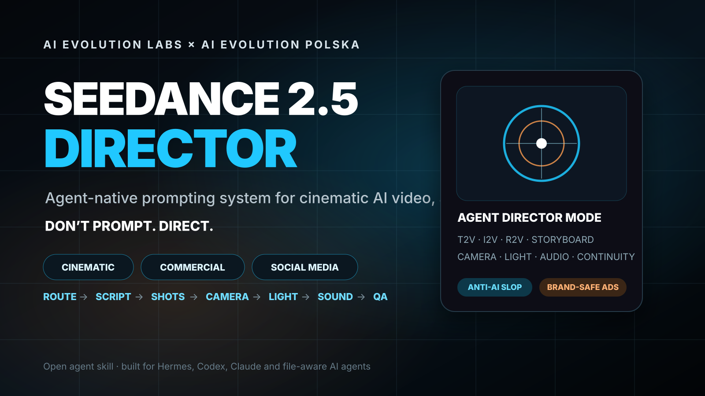

<div align="center">



# 🎬 Seedance 2.5 Director

### Agent-native directing system for cinematic AI video, advertising and social content

**Built by [AI Evolution Labs](https://aievolutionlabs.io) × AI Evolution Polska**

[](https://dreamina.capcut.com/seedance/seedance-2-5)
[](SKILL.md)
[](references/advertising-playbook.md)
[](references/social-media-playbook.md)
[](AGENTS.md)

**Don’t prompt video. Direct it.**

Turn a rough idea, image, product shot, script, storyboard or campaign brief into a production-ready Seedance 2.5 workflow with intelligent generation routing, scenario design, camera direction, lighting, sound, continuity and anti-AI-slop QA.

[📖 Read the skill](SKILL.md) · [🤖 Agent runtime](AGENTS.md) · [🧠 Claude adapter](CLAUDE.md) · [📋 Universal master prompt](MASTER_PROMPT.md) · [🎞️ Examples](examples/SHOWCASE.md)

🌐 **[Interactive project page](https://instasite.ai/create/dc3f2586-b30c-4fb7-9652-25058b92332f)**

</div>

---

## Why this exists

Most AI-video prompts are adjective soup:

```text
cinematic, epic, ultra realistic, dynamic camera, dramatic lighting, masterpiece...
```

That is not directing.

**Seedance 2.5 Director** teaches an AI agent to make production decisions before it writes the final prompt.

The system asks:

```text
What is the actual communication goal?
What must stay identical?
Should this start from text, an image, several references or a storyboard?
What visibly happens?
Where is the camera and why does it move?
What should the viewer hear?
What must be true at the end?
What would make this look like generic AI slop?
```

Then it writes the prompt.

---

# ⚡ Core workflow

```text
IDEA / IMAGE / SCRIPT / CAMPAIGN BRIEF
                ↓
            INTENT
                ↓
       AUDIENCE / USE CASE
                ↓
       GENERATION ROUTING
   T2V · T2I→I2V · I2V · R2V
   STORYBOARD · MOTION REFERENCE
                ↓
       SCRIPT / STORY SPINE
                ↓
       REFERENCE AUTHORITY
                ↓
        CONTINUITY LOCKS
                ↓
         SHOT / BEAT PLAN
                ↓
        ACTION + PHYSICS
                ↓
      CAMERA + LENS + FOCUS
                ↓
    LIGHT + PRODUCTION DESIGN
                ↓
   PERFORMANCE + HUMANIZER
                ↓
      SOUND + MUSIC + FOLEY
                ↓
           END STATES
                ↓
       ANTI-AI-SLOP QA
                ↓
      FINAL SEEDANCE PROMPT
```

The first principle is simple:

> **Route before prompt.**

---

# 🧭 It chooses how the video should be generated

The agent does **not** assume Text-to-Video is always the answer.

| Situation | Preferred route |
|---|---|
| New fictional concept with no strict identity | **T2V** |
| No source image, but exact composition matters | **T2I → I2V** |
| User already has a valuable photo / product / room | **I2V** |
| Several assets control identity, product, motion or audio | **R2V** |
| Multi-shot story or client-approved shot plan | **Storyboard / animatic** |
| Complicated movement or product handling | **Motion reference / R2V** |
| Most of the clip works and one layer failed | **Targeted repair / edit when supported** |

Full routing logic: [`references/generation-routing.md`](references/generation-routing.md)

## The key I2V rule

```text
PRESERVE FIRST.
ANIMATE SECOND.
```

If the image already contains the correct person, product, room, car, food item or composition, the agent focuses the prompt on **motion and change**, not on redescribing and accidentally redesigning the source.

---

# 🖼️ Text-to-Image is part of the video workflow

Sometimes the smartest route is:

```text
idea
→ generate a production-ready start frame
→ inspect composition / identity / lighting
→ animate the approved frame
```

A good starting image is designed for motion:

- clear subject separation
- physically plausible pose
- visible hands / joints when needed
- depth layers for camera movement
- room in frame for the planned action
- coherent light sources
- no impossible overlaps
- useful negative space for social / ads

The skill treats the first image as a **keyframe**, not just pretty artwork.

---

# 🎬 Cinematic directing, not cinematic keywords

The skill translates vague requests into concrete cinematography.

Instead of:

```text
dynamic cinematic camera, epic lighting
```

it aims for direction such as:

```text
low-angle medium tracking shot, camera moves backward at walking speed with a stable horizon, 35mm lens feel, focus locked on the eyes, large soft key from camera-left, warm practicals behind the subject and restrained negative fill on the far cheek
```

The cinematic system covers:

- shot size
- angle
- blocking
- lens perspective
- camera speed
- focus behaviour
- foreground / midground / background depth
- motivated transitions
- lighting continuity
- deliberate final frames

See [`references/cinematic-playbook.md`](references/cinematic-playbook.md).

---

# 🧠 Anti-AI Slop Engine

The skill includes a dedicated visual humanizer and anti-slop layer.

It actively removes patterns that make AI video feel synthetic:

❌ purposeless orbit cameras  
❌ constant floating-gimbal movement  
❌ generic cyberpunk / neon defaults  
❌ fog and particles everywhere  
❌ plastic skin  
❌ frozen facial performance  
❌ floating feet  
❌ impossible hands  
❌ rubbery food  
❌ melting products  
❌ morphing architecture  
❌ random subtitles  
❌ transitions with no story purpose  
❌ cuts every second just to look “dynamic”

Instead it adds restrained physical cues when appropriate:

✅ breathing  
✅ weight transfer  
✅ eye movement before head movement  
✅ fingers settling around an object  
✅ cloth / hair inertia  
✅ natural reaction timing  
✅ believable acceleration and stopping  
✅ environmental motion with a physical cause

Core rule:

```text
SPECIFIC CAUSALITY > DECORATIVE SPECTACLE
```

See [`references/anti-ai-slop.md`](references/anti-ai-slop.md).

---

# 📣 Built for advertising

This is not only a cinematic prompt library.

Commercial mode begins with the marketing job:

```text
AUDIENCE
→ PROBLEM / DESIRE
→ ONE MESSAGE
→ PROOF / DEMONSTRATION
→ BENEFIT / RESULT
→ HERO FRAME
→ CTA HANDOFF
```

The skill supports:

- ecommerce
- product ads
- local-service campaigns
- food advertising
- beauty
- fashion
- automotive
- interiors / renovation
- technology
- luxury
- paid social
- creator / UGC-style ads

For real client assets:

```text
ACCURACY FIRST.
MESSAGE SECOND.
CINEMATIC POLISH THIRD.
```

A beautiful shot is useless if the product shape, room architecture or service promise becomes wrong.

See [`references/advertising-playbook.md`](references/advertising-playbook.md).

---

# 📱 Social media director mode

For Reels, TikTok and Shorts the skill treats short-form as its own format rather than “vertical cinema”.

It focuses on:

- still-readable first-frame hook
- fast premise recognition
- vertical-safe composition
- readable face / product scale
- 3–5 meaningful beats for many short clips
- perspective changes only when new information appears
- escalation / proof
- payoff
- clean end or loop point

A useful short-form structure:

```text
HOOK
→ CURIOSITY
→ PROGRESSION / PROOF
→ PAYOFF
→ CLEAN END
```

See [`references/social-media-playbook.md`](references/social-media-playbook.md).

---

# ✍️ It can write the scenario before the prompt

When the concept contains several events, dialogue, a transformation, before/after, comedy or an advertising message, the agent first solves the scenario.

It creates a one-sentence story spine, then only the beats that matter.

Example:

```text
An unfinished fireplace room becomes a complete warm living space through one team's craft, so the viewer understands they can handle the entire transformation.
```

Then:

```text
PROBLEM
→ CRAFT / PROOF
→ MOTIVATED TRANSITION
→ FINISHED RESULT
```

Only after the story works does it design the shots.

See [`references/script-storyboard.md`](references/script-storyboard.md).

---

# 🔊 Sound is a production layer

The Director can plan:

- dialogue
- room / street / environment ambience
- foley
- product-contact sounds
- cinematic SFX
- music direction
- beat timing
- sound bridges
- mix priority

It does not default to “epic cinematic music”.

Example:

```text
AUDIO
Dialogue: foreground and clean
Ambience: quiet luxury bathroom room tone
Foley: delicate glass contact on marble
Music: restrained electronic pulse, no aggressive drums
Sync cue: subtle low accent lands on the final hero frame
```

See [`references/sound-music.md`](references/sound-music.md).

---

# 🧩 Reference authority

Seedance 2.5 is especially useful when the agent knows **why each reference exists**.

Example:

```text
REFERENCE AUTHORITY
@Image1 = exact face identity and hairstyle
@Image2 = outfit only; ignore its face
@Image3 = exact product geometry and label position
@Video1 = body movement and timing only
@Audio1 = rhythm only
@Storyboard1 = shot order and framing only
```

This reduces reference collisions and identity / product drift.

---

# 🎯 End states make prompts controllable

Weak:

```text
the transformation finishes
```

Better:

```text
end state: armour panels are fully locked, helmet is closed, both feet contact the floor and the subject faces camera while motion settles
```

The skill uses visible end states for important beats so the model has something concrete to land on.

---

# 🤖 Agent compatibility

The folder is structured so different agents can understand the same directing system.

| Agent / environment | Entry file |
|---|---|
| Hermes / skill-aware agent | [`SKILL.md`](SKILL.md) |
| Codex / AGENTS-aware workflows | [`AGENTS.md`](AGENTS.md) |
| Claude / Claude Code | [`CLAUDE.md`](CLAUDE.md) |
| Generic LLM / custom agent | [`MASTER_PROMPT.md`](MASTER_PROMPT.md) |
| Machine-readable discovery | [`manifest.json`](manifest.json) |

## Generic installation

Copy this folder into the location your agent uses for reusable instructions / skills.

Then tell the agent to read the appropriate entry file.

### Minimal generic usage

```text
Read MASTER_PROMPT.md and use it as your Seedance directing policy.
Then turn this idea into a 10-second vertical product ad: [idea]
```

### Agent-aware usage

```text
Use the seedance-2-5-director skill.
Animate this supplied image into a premium 10-second Reel.
Preserve the exact product.
```

The agent should decide the route itself.

---

# 📂 Project structure

```text
seedance-2-5-director/
├── README.md
├── SKILL.md
├── AGENTS.md
├── CLAUDE.md
├── MASTER_PROMPT.md
├── manifest.json
├── assets/
│   └── cover.svg
├── examples/
│   └── SHOWCASE.md
└── references/
    ├── model-profile.md
    ├── generation-routing.md
    ├── cinematic-playbook.md
    ├── advertising-playbook.md
    ├── social-media-playbook.md
    ├── script-storyboard.md
    ├── sound-music.md
    ├── anti-ai-slop.md
    ├── prompt-patterns.md
    └── failure-diagnosis.md
```

---

# 🧪 Example request

```text
I have one photo of a burger.
Make a 10-second Reel that makes it look premium and hot.
The burger itself must not change.
```

The skill should reason approximately like this:

```text
ROUTE
I2V because the supplied image defines the exact food build.

MOTION BUDGET
Low-to-medium because food geometry must remain stable.

STORY
texture hook → reveal → one physical interaction → hero frame

ANTI-SLOP
no floating ingredients, no impossible cheese stretch, no rubber physics

AUDIO
foreground grill sizzle + clean cut / contact + restrained music
```

Then it returns the production-ready prompt.

See the full gallery in [`examples/SHOWCASE.md`](examples/SHOWCASE.md).

---

# 🛠️ Failure repair

If one part of a generation fails, the skill does not blindly rewrite everything.

It identifies the first causal failure:

```text
face drift
hand anatomy
grip / contact
product mutation
architecture drift
camera chaos
bad lip sync
weak ad proof
AI slop
```

Then patches only that layer where possible.

See [`references/failure-diagnosis.md`](references/failure-diagnosis.md).

---

# 🧪 Seedance 2.5 model notes

The skill is written specifically around current **Seedance 2.5** production guidance.

Official Dreamina material currently describes Seedance 2.5 workflows including:

- Text-to-Video
- Image-to-Video
- Reference-to-Video
- multimodal image / video / audio / script / storyboard inputs
- motion guidance using green-screen / white-model style references
- longer continuous video workflows
- stronger continuity
- local refinement / editing workflows
- commercial, ecommerce, social and cinematic use cases

Official materials also advertise up to **30-second standard video**, **up to 50 multimodal inputs** and **4K-oriented output workflows**, while availability and exact controls can vary by provider, account, region and rollout stage.

For that reason the skill separates:

```text
CREATIVE DIRECTION
from
PROVIDER-SPECIFIC EXECUTION PARAMETERS
```

It never assumes a UI field or API parameter exists without verification.

Official references:

- [Seedance 2.5 official overview](https://dreamina.capcut.com/seedance/seedance-2-5)
- [How to use Seedance 2.5](https://dreamina.capcut.com/seedance/how-to-use-seedance-2-5)
- [Seedance 2.5 R2V](https://dreamina.capcut.com/seedance/seedance-2-5-r2v-reference-to-video)
- [Seedance 2.5 motion reference guide](https://dreamina.capcut.com/seedance/seedance-2-5-motion-reference-guide)

---

# Principles

```text
ROUTE BEFORE PROMPT.
STORY BEFORE CAMERA.
ACCURACY BEFORE SPECTACLE.
CAUSE BEFORE EFFECT.
DESIGN THE FIRST FRAME.
DESIGN THE LAST FRAME.
DIRECT THE SCENE.
DO NOT DECORATE THE PROMPT.
```

---

<div align="center">

### Built for people who want AI video to feel directed, not generated.

**AI Evolution Labs × AI Evolution Polska**

[AI Evolution Labs](https://aievolutionlabs.io) · [Seedance 2.5 official](https://dreamina.capcut.com/seedance/seedance-2-5)

</div>
